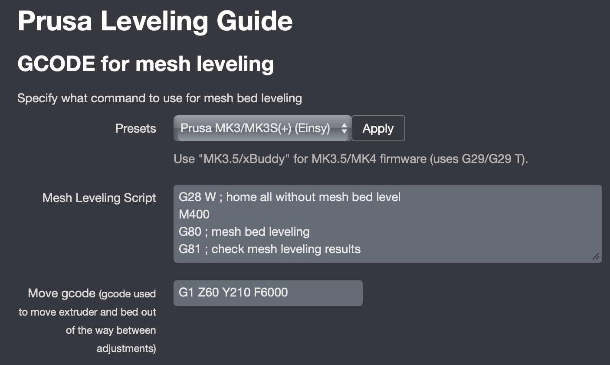

# OctoPrint-PrusaLevelingGuide

This plugin guides you through fine adjustments of the bed. Some of these mods are linked in the Guides section below. It supports Prusa MK3 family (MK3/MK3S/MK3S+) and MK3.5 (xBuddy) firmware for reading mesh reports.

## Supported Printers

- Einsy (MK3/MK3S/+): Uses `G80`/`G81` for mesh probing/reporting.
- xBuddy (MK3.5): Uses `G29` to probe and `G29 T` to print the mesh report.
- Other models/firmware: Not officially supported. The plugin expects mesh reports in the classic `G81` or xBuddy `G29 T` formats.

## Setup

Install via the bundled [Plugin Manager](https://github.com/foosel/OctoPrint/wiki/Plugin:-Plugin-Manager)
or manually using this URL:

    https://github.com/scottrini/OctoPrint-PrusaLevelingGuide/archive/master.zip


## Guides

* [Silicone Mod for the MK3](https://www.schweinert.com/silicone-bed-level-mod-prusa-mk3)
* [Silicone Mod for the MINI](https://github.com/bbbenji/PMSBLM)
* [Nylock Mod for the MK3S](https://www.jackvmakes.com/guides/nylock-mod-for-the-mk3s)
* [Bed Leveling without Wave Springs](https://github.com/PrusaOwners/prusaowners/wiki/Bed_Leveling_without_Wave_Springs)

## Known Issues
* Installation may silently fail due to missing system dependencies on older images. Prefer upgrading to a modern OctoPi/OctoPrint release. If upgrading is not possible, install linear algebra libs (e.g. `sudo apt install libatlas3-base` on Debian-based systems).
* This plugin calculates relative values from the printer's mesh report. It will not work with firmware that significantly alters the format of the G81 or G29 T reports.

## Preheating profiles

The profiles listed for preheating are the temperature profiles defined in octoprint.  To define more, browse to Settings->Temperatures.  You can also define temperature profiles that just preheat the bed, just the nozzle, or use the default ones that preheat both.


## 7x7 vs 3x3 for adjustments

Previously, this plugin used `G80 N3` to enforce using 3x3 bed leveling in the default gcode. Without the `N3`, it uses whatever you have configured in the firmware. The `N3` is no longer in the default settings, but you might still have it configured if you've updated from a previous version. If you'd like to use what is configured on your printer, make sure the `N3` is not present in your settings.

On xBuddy (MK3.5), larger mesh densities are common. The plugin will parse any N×N mesh (e.g., 7×7 from `G81` or denser grids from `G29 T`) and reduce it to a 3×3 set mapped to your screw locations for adjustment. You do not need to change your firmware’s mesh density for use with this plugin.


## Adjusting your bed

Once you're ready to adjust using this plugin, pull up the tab in your octoprint instance.  Decide if you want to preheat the bed while making adjustments.  Preheating isn't absolutely necessary for your initial adjustments, but really fine tuning the bed should be done preheated, as the values will change when things are heated.

So select your profile and whether to preheat, then click begin adjusting.  The plugin will:
- Preheat (if enabled)
- Send the mesh level command and retrieve results
- Wait for the command to complete
- Send gcode to move the bed and extruder out of the way
- Update the UI with the values

Once the UI is updated, the status will change to *Waiting for continue*.  This is your opportunity to adjust the screws.  The raw value view does not provide the direction to turn the screws.  If it's a negative value, loosen the screw.  If it's positive, tighten the screw.

All of the other views will display an arrow next to the value to show which direction to rotate the screw. Once you've made your adjustments, click continue to start another mesh check and update the UI with the new values. If you've gotten your bed to a variance you're happy with, click **Finished**. If the printer was preheated, this will disable the preheating.

Planned: Allow configuration of a 'target bed variance' and alert whenever the bed is higher than the target variance — this requires including `G81` (Einsy) or `G29 T` (xBuddy) in your print start/finish gcode so the plugin can capture the latest mesh.

You have the option of viewing the values in a table view or overlaid on a photo of the heatbed. You can also customize whether you view raw values, degrees, decimal turns, or fractional turns.

**Configuration View**


**Photo Bed View**


**Table View**


## Configuration

The configuration tab allows you to customize the gcode for mesh leveling similar to the PrusaMeshMap plugin.

Preset helper: A visible "Presets" selector is available above the script box.

- Choose "Prusa MK3.5 (xBuddy)" to autofill the correct sequence using `G29`/`G29 T`.
- Choose "Prusa MK3/MK3S(+) (Einsy)" to autofill the classic `G80`/`G81` sequence.

Click Apply, then Save settings. You can also customize the parking move in "Move gcode" (default `G1 Z60 Y210 F6000`) to improve access to the front screws for your setup.

## MK3.5 (xBuddy) Quick Start

1. Go to Settings → Prusa Leveling Guide → Presets and choose the xBuddy preset, then Apply and Save.
2. What it runs: `G28` (home), `M400` (sync), `G29` (probe mesh), `G29 T` (print mesh report).
3. Optional but recommended: enable preheat and select a temperature profile for more accurate fine tuning.
4. Open the plugin tab and click "Begin Adjusting". The plugin will probe, park (using your Move gcode), and display per-screw directions.
5. Adjust, click Continue to re-probe, and repeat until the variance meets your target. Click Finished to stop (preheat is turned off if enabled).



## Inspirations

- [Bed Leveling without Wave Springs](https://github.com/PrusaOwners/prusaowners/wiki/Bed_Leveling_without_Wave_Springs) obviously I would not have written this plugin without this awesome mod/guide
- [OctoPrint-PrusaMeshMap](https://github.com/PrusaOwners/OctoPrint-PrusaMeshMap) This is the plugin I used previously to adjust my bed.  It works, but I wanted something a little more automated.  Some of the code for detecting g81 response was used from this plugin.
- [g81_level_guide](https://gitlab.com/gnat.org/g81_level_guide) I like the idea of this script because it automates the process, but I didn't like that it clears my preheat when connecting and that it was a pain to get running on a pi.  The idea inspired me to write this plugin.
- [g81_relative](https://github.com/pcboy/g81_relative) This is the site I originally used for converting my g81 values to relative numbers.  This is what inspired me to add all the different calculation types.


## Mesh Output Handler

Just like the PrusaMeshMap plugin, this plugin has a handler that is watching output received from the printer **at all times**. Add a mesh report command to your start/stop gcode to refresh the plugin automatically after each print:

- Einsy (MK3/MK3S/+): add `G81`
- xBuddy (MK3.5): add `G29 T`

Example (end gcode):

```
; Report mesh to OctoPrint plugin
G29 T ; xBuddy (MK3.5)
; or
G81   ; Einsy (MK3/MK3S/+)
```

Note: On xBuddy, `G29` performs probing but does not print the mesh; only `G29 T` prints the table that the plugin parses.

## Z Calibration can affect bed leveling

Note from *Spacemarine2018*

If you re-calibrate your Z-axis after leveling your bed, it might look like the whole left or right side of the bed is suddenly higher/lower than the other side. The reason for this is that the Z-axis leadscrews might have changed their angular position relative to each other due to soft mechanical upper stops. If this is the case, try to rotate one of the leadscrews by hand by one or two clicks instead of re-adjusting the bed again.